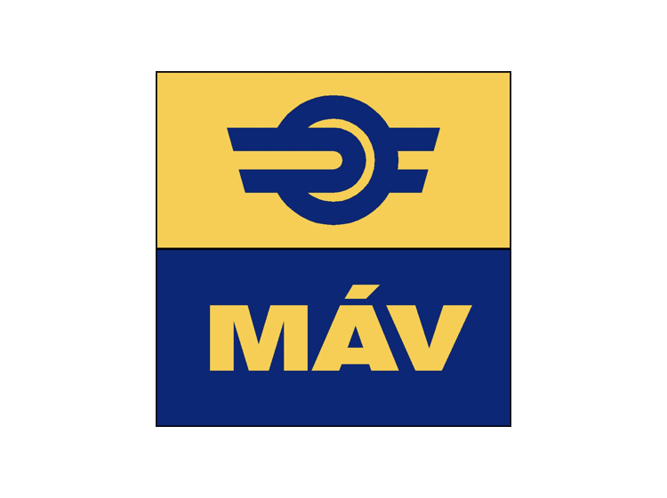

## Ez a MÁV utastájékozatató tanuló verziója

   ⏰ induló és érkezö vonatok


## 👀   Ez a mávnak az induló és érkező vonatoknak a demója

 🚉 Ez a project egy egyszerű webes felületet biztosít a MÁV vonatindulások és érkzések megjelenítésére.

## 🖥️ Linkje

🏗️ [ Máv utastájékezotató] (https://hunor-beep.github.io/2025_01_30_mav_utastajekoztato/)

```html
    <table>
        <thead>
            <tr>
                <th>08:43:10</th>
                <th>Indulás</th>
                <th colspan="2">Induló járatok</th>
                <th>Departures</th>
                <th></th>
            </tr>
            
            <tr>
                <th>Tervezet indulás</th>
                <th>Valós indulás</th>
                <th>Vonat</th>
                <th>Honnan</th>
                <th>Hova</th>
                <th>Vágány</th>
            </tr>
              
        </thead>
```

## 🎨 CSS Stílusok
```css
body {
    font-family: Arial, sans-serif;
    background-color: #f8f9fa;
    text-align: center;
}

table {
    width: 80%;
    margin: 20px auto;
    border-collapse: collapse;
}
```

### 🔧 Fejlesztési lehetőségek
- [ ] 🔄 Dinamikus adatbetöltés API-n keresztül
- [ ] 🔍 Keresési és szűrési lehetőségek
- [x] 📱 Reszponzív megjelenítés mobileszközökre

